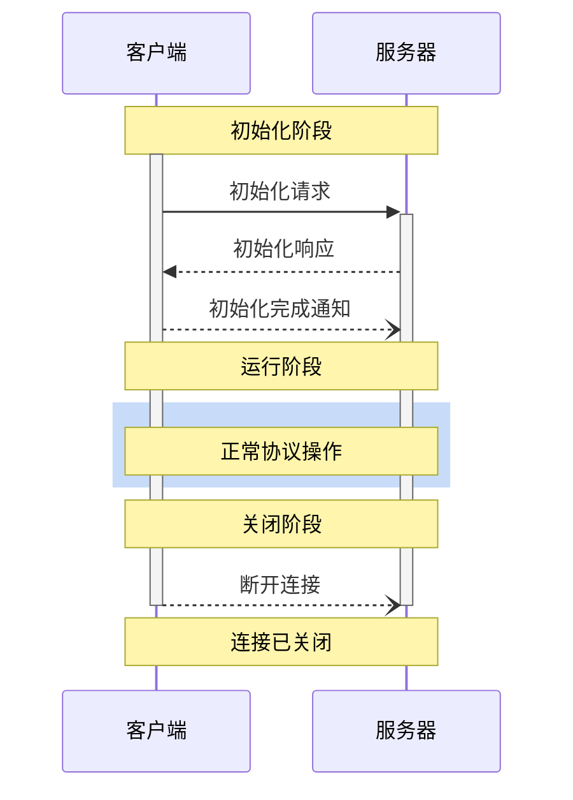
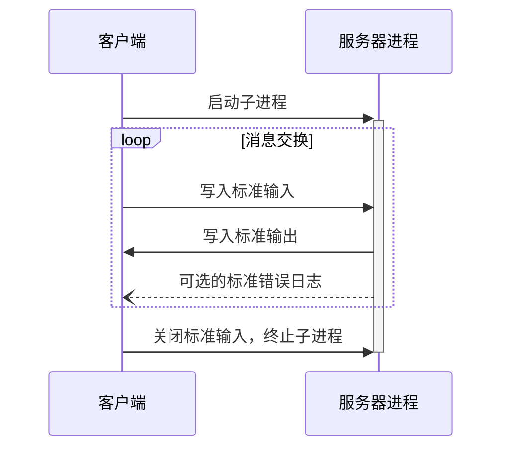
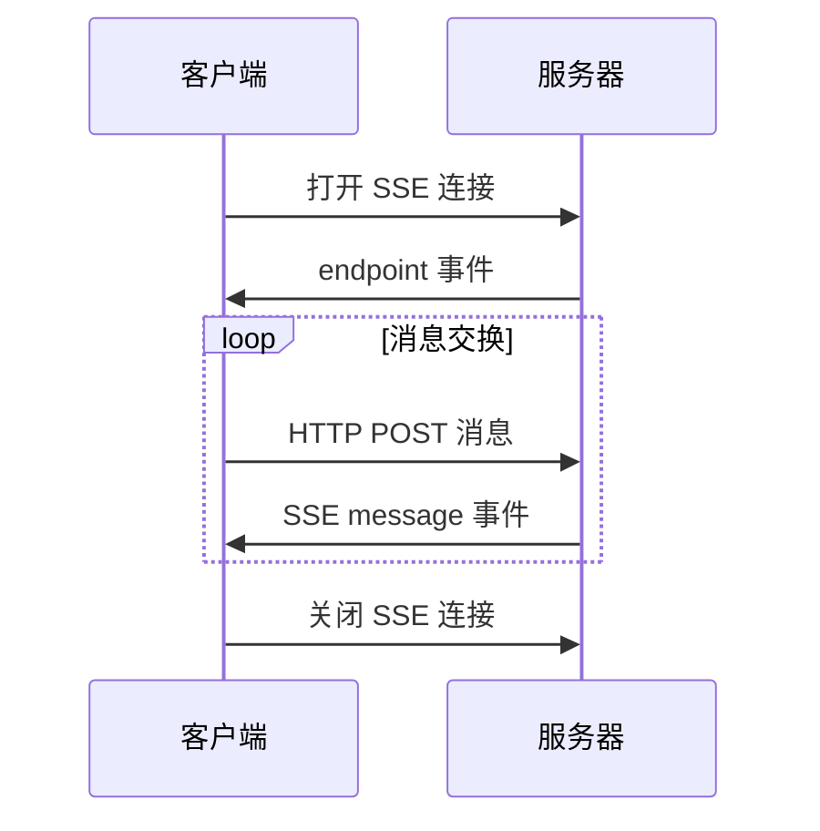

# MCP

Claude [MCP](https://mcp.programnotes.cn/zh)，即模型上下文协议（Model Context Protocol），是 Anthropic Claude 的一个开源开放协议，旨在建立 AI 模型和开发环境之间的统一上下文交互，通过提供标准化的上下文信息访问，使 AI 模型能够更好地理解和处理代码。就像给它们之间搭建了一座桥梁，使得开发者可以通过一套标准将 AI 应用和数据源连接起来 。

[](https://mcp.programnotes.cn/zh)

例如，在实际应用中，通过 Claude 桌面应用，借助 [MCP](https://mcp.programnotes.cn/zh) 协议，AI 可以帮用户管理 GitHub 项目，从创建项目到提交代码请求等复杂任务都能轻松完成，而且速度很快。这一协议的出现，有望彻底解决 LLM（大型语言模型）应用连接数据难的痛点，让前沿模型生成更好、更相关的响应，不再需要为每个数据源写定制的集成代码，一个 [MCP](https://mcp.programnotes.cn/zh) 协议就可以搞定与多种数据源的连接 。

## 应用场景

### 代码管理与开发

在代码开发方面，Claude 通过 [MCP](https://mcp.programnotes.cn/zh) 协议可以直接连接 GitHub。开发人员可以利用 Claude 自动化编程，例如让 AI 自己写代码、创建仓库、Push 代码、创建 Issue、创建分支、创建 PR 等操作，全程无需离开聊天界面，开发人员仅需提出需求即可 。这大大提高了开发效率，将开发人员从繁琐的代码操作中部分解放出来，更多地扮演需求提出者的角色。

### 数据管理与交互

#### 本地资源管理

[MCP](https://mcp.programnotes.cn/zh) 协议支持对本地资源的管理，如电脑里的文件、数据库（像 SQLite 数据库）等。开发人员可以使用 [MCP](https://mcp.programnotes.cn/zh) 协议让桌面版 Claude 安全连接本地服务，进行文件的创建、读取、编辑等操作，还能对数据库中的数据进行交互操作，例如查询、更新等 。

#### 远程资源交互

对于远程资源，如 `GoogleDrive`、`Slack` 等平台的数据，Claude 借助 [MCP](https://mcp.programnotes.cn/zh) 协议可以直接进行控制和访问。这使得企业和开发者在构建 AI 应用时，能够轻松整合不同来源的数据，如从商业工具、软件、内容库、应用程序开发环境等各种来源提取资料，协助模型产生与指令更相关的回复 。

### 构建智能助手应用

随着大模型从纯聊天机器人走向以智能助手为代表的 Agent 应用，[MCP](https://mcp.programnotes.cn/zh) 协议可以让 AI 系统更加智能和强大。开发人员通过 [MCP](https://mcp.programnotes.cn/zh) 协议将 AI 系统与多个数据源相连接后，AI 工具不再只是简单的问答系统，而是变成了一个能够执行复杂任务、管理代码、处理文件和与外部系统通信的强大工具。例如，在构建一个企业内部的智能助手时，可以利用 [MCP](https://mcp.programnotes.cn/zh) 协议连接企业内部的各种数据资源（如数据库、文件服务器等）以及外部相关的业务工具（如项目管理工具等），为企业员工提供更全面、更高效的服务。

## Claude [MCP](https://mcp.programnotes.cn/zh) 协议的优缺点

### 优点

**简化数据连接**

对于开发人员来说，[MCP](https://mcp.programnotes.cn/zh) 协议最大的优点之一就是**简化了 AI 应用与数据源之间的连接**。在过去，为了让 LLM 应用连接不同的数据源，开发者需要为每个数据源写定制的集成代码，这是非常麻烦且重复的工作。而有了 [MCP](https://mcp.programnotes.cn/zh) 协议，开发人员只需将其与他们的 AI 工具集成一次，就可以连接到任何地方的数据源。例如，无论是连接本地的数据库，还是像 GitHub、Slack 这样的远程平台，都可以使用同一个 [MCP](https://mcp.programnotes.cn/zh) 协议，大大减少了开发工作量，提高了开发效率 。

**提高数据交互的安全性**

所有的数据交互都是通过标准化的协议进行的，这意味着可以更好地控制数据的流动，防止数据泄露。[MCP](https://mcp.programnotes.cn/zh) 服务器内置了安全机制，允许服务器自己控制资源，不用把 API 密钥给 LLM 提供商。例如，当 Claude 通过 [MCP](https://mcp.programnotes.cn/zh) 协议连接到企业内部的数据库时，[MCP](https://mcp.programnotes.cn/zh) 服务器可以在遵循企业安全策略的前提下进行数据交互，保护企业数据的安全 。

**增强 AI 应用的功能**

使 AI 应用不再只是一个简单的问答系统，而是变成了一个能够执行复杂任务、管理代码、处理文件和与外部系统通信的强大工具。例如，通过 [MCP](https://mcp.programnotes.cn/zh) 协议连接到 GitHub 后，Claude 可以进行一系列复杂的代码管理操作，从创建项目到提交代码请求等，拓宽了 AI 应用的功能范围，使其在更多的业务场景中发挥作用 。

**良好的可扩展性**

[MCP](https://mcp.programnotes.cn/zh) 协议具有良好的可扩展性，提供了 `Prompts`、`Tools`、`Sampling` 等功能。这些功能可以方便地扩展 AI 应用与数据源交互的能力，满足不同应用场景的需求。例如，开发人员可以根据具体需求创建新的 `Prompts` 模板或者利用 `Tools` 中的功能来扩展数据处理能力，并且随着技术的发展和新需求的出现，可以通过 `Sampling` 等功能优化 AI 的行为 。

**数据形式支持广泛**

支持的数据形式非常多样，包括文件内容、数据库记录、API 响应、实时系统数据、屏幕截图和图像、日志文件等，几乎覆盖了所有类型。这使得 [MCP](https://mcp.programnotes.cn/zh) 协议可以适用于各种不同类型的数据交互场景，无论是处理文本数据、图像数据还是系统运行数据等都可以胜任 。

### 缺点

**行业标准竞争压力大**

当前在数据连接和交互领域有众多的标准在竞争，[MCP](https://mcp.programnotes.cn/zh) 协议只是其中之一，要想成为行业通用标准面临很大的挑战。例如，在 AI 领域，其他类似的协议或技术也在不断发展，可能会分散市场的注意力和资源，使得 [MCP](https://mcp.programnotes.cn/zh) 协议的推广和普及受到一定的阻碍 。

**可能存在兼容性问题**

虽然 [MCP](https://mcp.programnotes.cn/zh) 协议旨在实现不同数据源和 AI 应用的连接，但在实际应用中可能会遇到兼容性问题。由于数据源和 AI 应用的多样性，可能存在某些数据源或者 AI 应用在与 [MCP](https://mcp.programnotes.cn/zh) 协议集成时出现不兼容的情况。例如，一些老旧的系统或者特殊定制的数据源可能无法很好地与 [MCP](https://mcp.programnotes.cn/zh) 协议进行对接，需要进行额外的适配工作。

**对协议本质存在质疑**

有观点认为 [MCP](https://mcp.programnotes.cn/zh) 本质上只是一个工程优化的方案，而且并不是一个非常完美的工程优化方案。例如，有人觉得最暴力的情况下，甚至直接提供 HTTP 接口给 LLM，识别 Json 并进行调用，这和 [MCP](https://mcp.programnotes.cn/zh) 没有本质上的区别，质疑其是否能够称之为一个真正的协议，本质上可能更像是 `FunctionCall + Proxy` 的组合 。

**目前应用范围受限**

目前 [MCP](https://mcp.programnotes.cn/zh) 仅支持本地运行（服务器需要在自己的机器上），虽然官方正计划构建具有企业级身份验证的远程服务器支持（为企业内部共享提供支持），但目前这种限制在一定程度上影响了其在更广泛场景下的应用。例如，对于一些需要在多台设备或者分布式环境下进行数据交互的应用场景，目前的 [MCP](https://mcp.programnotes.cn/zh) 协议可能无法满足需求。


## MCP 基础协议

MCP 协议遵循客户端-主机-服务器架构，MCP 协议其实就是规定的组件之间的通信协议，而 MCP 中的所有消息必须遵循 `JSON-RPC 2.0` 规范。

### 消息类型

MCP 协议定义了三种类型的消息：

- `request`：请求消息，用于客户端向服务器发送请求，也可以从服务器发送到客户端。
- `response`：响应消息，用于对请求的响应。
- `notification`：通知消息，用于服务器向客户端发送通知。

#### 请求消息

双向消息，可以从客户端发送到服务器，也可以反向发送。如下所示就是一个请求消息的示例：

```json
{
  "jsonrpc": "2.0",
  "id": "string | number",
  "method": "string",
  "param?": {
    "key": "value"
  }
}
```

在请求消息中，有一些需要注意的点：

- 必须包含字符串或整数类型的 ID
- ID 不能为 null
- 在同一会话中，请求方不能重复使用相同的 ID
- 可以包含可选的参数对象

#### 响应消息

响应消息是对请求的回复，响应消息的结构如下所示：

```json
{
  "jsonrpc": "2.0",
  "id": "string | number",
  "result?": {
    "[key: string]": "unknown"
  },
  "error?": {
    "code": "number",
    "message": "string",
    "data?": "unknown"
  }
}
```

同样，在响应消息中，也有一些需要注意的点：

- 必须包含与对应请求相同的 ID
- 必须设置 `result` 或 `error` 其中之一，不能同时设置
- 错误码必须是整数
- 可以包含可选的结果数据

#### 通知消息

通知是一种单向消息，不需要响应：

```json
{
  "jsonrpc": "2.0",
  "method": "string",
  "params?": {
    "[key: string]": "unknown"
  }
}
```

在通知消息中，有一些需要注意的点：

- 不能包含 ID 字段
- 用于状态更新和事件通知
- 可以包含可选的参数对象
- 减少通信开销，支持异步操作

### 生命周期

MCP 为客户端-服务器连接定义了严格的生命周期，确保连接的可靠性和稳定性。主要分为三个阶段：

- 初始化：能力协商和协议版本约定
- 操作：正常协议通信
- 关闭：正常终止连接

如下图所示：



#### 初始化阶段

初始化阶段必须是客户端和服务器之间的第一次交互。在此阶段，双方：

- 建立协议版本兼容性
- 交换和协商能力
- 共享实现细节

初始化请求示例：

```json
{
  "jsonrpc": "2.0",
  "id": 1,
  "method": "initialize",
  "params": {
    "protocolVersion": "2024-11-05",
    "capabilities": {
      "roots": {
        "listChanged": true
      },
      "sampling": {}
    },
    "clientInfo": {
      "name": "ExampleClient",
      "version": "1.0.0"
    }
  }
}
```

要注意 ⚠️ 在初始化请求中，客户端必须发送其支持的协议版本，上面 json 中的 `params.protocolVersion` 字段就是来指定协议版本的。

- 客户端应发送其支持的最新版本
- 服务器必须响应相同版本或其支持的其他版本
- 如果客户端不支持服务器的版本，应断开连接

而 `params.capabilities` 字段用于能力协商，客户端和服务器能力确定会话期间可用的可选协议功能。在请求中我们指定客户端的能力，在响应中服务器会指定其能力，客户端可以指定如下能力：

- `roots`：提供文件系统根目录的能力
- `sampling`：支持 LLM 采样请求
- `experimental`：描述对非标准实验性功能的支持

初始化响应示例：

```json
{
  "jsonrpc": "2.0",
  "id": 1,
  "result": {
    "protocolVersion": "2024-11-05",
    "capabilities": {
      "logging": {},
      "prompts": {
        "listChanged": true
      },
      "resources": {
        "subscribe": true,
        "listChanged": true
      },
      "tools": {
        "listChanged": true
      }
    },
    "serverInfo": {
      "name": "ExampleServer",
      "version": "1.0.0"
    }
  }
}
```

在初始化响应中，服务器必须响应相同版本或其支持的其他版本。此外服务器会响应其能力，如下：

- `logging`：提供日志记录的能力
- `prompts`：提供提示词的模板能力
- `resources`：提供资源管理的能力
- `tools`：提供工具调用的能力
- `experimental`：描述对非标准实验性功能的支持

初始化完成后，服务器会发送初始化完成通知，如下所示：

```json
{
  "jsonrpc": "2.0",
  "method": "initialized"
}
```

#### 操作阶段

初始化完成后，客户端和服务器就可以进行正常的协议通信了，也就是上面的操作阶段，客户端和服务器根据协商的能力交换消息。

- 遵守协商的协议版本
- 仅使用成功协商的能力

#### 关闭阶段

当客户端或服务器决定关闭连接时，会发送断开连接通知，在关闭阶段，连接被优雅地终止。

- 客户端发送断开连接通知
- 服务器关闭连接
- 清理相关资源

这样 MCP 的一个完整生命周期就结束了。

### 传输机制

上面我们介绍了 MCP 协议的消息类型和生命周期，但是这些消息是如何在客户端和服务器之间传输的呢？MCP 协议定义了两种标准的客户端-服务器通信传输机制：

- `stdio`（标准输入输出）
- 基于 `SSE`（Server-Sent Events）的 HTTP

需要注意，客户端应尽可能支持 `stdio`，此外，客户端和服务器也可以以可插拔的方式实现自定义传输机制。

#### 标准输入输出（stdio）

在 stdio 传输机制中：

- 客户端将 MCP 服务器作为子进程启动
- 服务器通过标准输入（`stdin`）接收 `JSON-RPC` 消息，并通过标准输出（`stdout`）写入响应
- 消息以换行符分隔，且**不能**包含嵌入的换行符
- 服务器**可以**将 UTF-8 字符串写入标准错误（`stderr`）用于日志记录。客户端**可以**捕获、转发或忽略这些日志
- 服务器**不得**向标准输出（`stdout`）写入任何无效 `MCP` 消息的内容
- 客户端**不得**向服务器的标准输入（`stdin`）写入任何无效 `MCP` 消息的内容

下图展示了 `stdio` 传输机制的交互过程：



#### 基于 SSE 的 HTTP

`SSE` 全称是 `Server-Sent Events`，是一种 HTTP 服务器推送技术，允许服务器向客户端发送实时更新。在 MCP 的 SSE 传输机制中，服务器作为独立进程运行，可以处理多个客户端连接。

首先服务器**必须**提供两个端点：

- SSE 端点 - 用于客户端建立连接并接收来自服务器的消息
- HTTP POST 端点 - 用于客户端向服务器发送消息

当客户端连接时，服务器**必须**发送一个包含客户端用于发送消息的 URI 的 endpoint 事件。所有后续的客户端消息必须作为 HTTP POST 请求发送到此端点。服务器消息作为 SSE message 事件发送，消息内容以 JSON 格式编码在事件数据中。

下图展示了基于 SSE 的 HTTP 传输机制的交互过程：



#### 自定义传输机制

客户端和服务器**可以**以可插拔的方式实现自定义传输机制。该协议与传输无关，可以在任何支持双向消息交换的通信通道上实现。

选择支持自定义传输的实施者**必须**确保他们保留 MCP 定义的 `JSON-RPC` 消息格式和生命周期要求。自定义传输**应该**记录其特定的连接建立和消息交换模式，以帮助互操作性。
